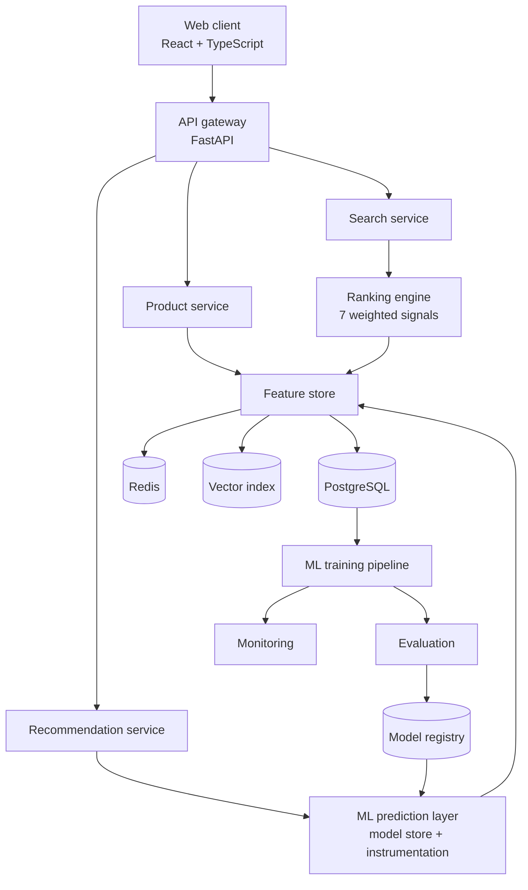

# E-Commerce Intelligence

An AI-powered e-commerce platform: a shopping storefront backed by a hybrid
recommendation engine, hybrid search, demand forecasting, price intelligence,
review sentiment analysis and customer segmentation — with the MLOps surface
(model registry, drift detection, latency monitoring) needed to operate them.

> **All bundled data is synthetic.** The catalogue, customers, orders, reviews
> and events are produced by a latent-factor simulation in
> `ml/datasets/synthetic.py`. No real retailer's data, branding or intellectual
> property is used anywhere in this project.

---

## Contents

- [Features](#features) · [Architecture](#architecture) · [Tech stack](#tech-stack)
- [Quick start](#quick-start) · [Configuration](#configuration) · [Running locally](#running-locally)
- [Machine learning](#machine-learning) · [API](#api) · [Testing](#testing)
- [Project structure](#project-structure) · [Troubleshooting](#troubleshooting)

---

## Features

### Shopping experience
- **Personalized homepage** whose *section mix* adapts to the shopper — known
  customers get "Recommended for you", "Continue shopping" and "Recently viewed";
  new visitors get popularity and trending rails instead.
- **Hybrid search** combining BM25 keyword matching with dense-vector semantic
  retrieval, typo tolerance, natural-language constraint parsing (`laptop under $500`),
  faceting, filtering and six sort modes.
- **Product pages** with specifications, reviews, aspect-level sentiment, similar
  products, frequently-bought-together and personalized recommendations.
- **Explainable recommendations** — every card states *why* it was surfaced, and
  the score breakdown per signal is available in the API response.
- Cart, checkout, order history and a behavioural profile page.

### Intelligence
| Capability | Approach | Beats baseline by |
|---|---|---|
| Recommendations | BM25-weighted implicit-feedback SVD + item-item CF + content embeddings, popularity-residualised, weights fitted on a validation split | +4.6% NDCG@10 vs popularity, 10x vs random |
| Review sentiment | Word+char TF-IDF -> calibrated logistic regression, plus lexicon aspect extraction with negation handling | 91.5% accuracy vs 76.9% majority class |
| Demand forecasting | Weekly seasonal-naive baseline + gradient-boosted **residual** correction | -8.5% MAE vs seasonal naive |
| Price intelligence | Gradient boosting on log-price with leave-one-out category context | -51.1% MAE vs category median |
| Segmentation | RFM + behavioural features -> K-Means, k chosen by silhouette with a granularity rule | silhouette 0.34, 6 actionable segments |

### Operations
- Model registry with versioned artifacts, metrics and dataset lineage.
- Drift detection comparing live feature distributions against training baselines.
- Per-model latency (mean/p95), call counts and error rates from real traffic.
- Feature store with versioning and timestamps, Redis-backed online reads.
- Structured JSON logging with request correlation IDs, health/liveness/readiness
  probes, rate limiting and security headers.

---

## Architecture



Full diagrams — recommendation pipeline, search pipeline, training pipeline,
forecasting, segmentation, data flow and deployment — are in
[`docs/architecture.md`](docs/architecture.md).

### Dual-mode runtime

The stack runs in two modes from the same code path:

| | Zero-setup (default) | Production (`docker compose`) |
|---|---|---|
| Database | SQLite | PostgreSQL |
| Cache | in-process LRU+TTL | Redis |
| Vectors | exact numpy index | pgvector (optional) |
| Workers | in-process thread scheduler | Celery |

Dependencies are probed at startup and the fallback is chosen automatically, so
`make seed && make train && make dev-backend` works with nothing installed but
Python. Missing *models* degrade gracefully too: the storefront falls back to
popularity-ranked results rather than erroring.

---

## Tech stack

**Frontend** React 18 · TypeScript · Vite · Tailwind CSS · React Router · TanStack Query · Recharts · Lucide
**Backend** Python 3.10–3.14 (3.11 in Docker/CI) · FastAPI · Pydantic v2 · SQLAlchemy 2 · Alembic · PostgreSQL · Redis · Celery
**ML** NumPy · pandas · scikit-learn · SciPy · joblib (XGBoost/LightGBM/sentence-transformers optional)
**Infra** Docker · Docker Compose · Nginx · GitHub Actions

---

## Quick start

### Docker (full stack)

```bash
cp .env.example .env
docker compose up --build
```

The `migrate` service runs migrations, seeds synthetic data and trains all five
models before the API starts.

| Service | URL |
|---|---|
| Storefront | http://localhost:3000 |
| API | http://localhost:8000 |
| API docs (Swagger) | http://localhost:8000/docs |
| API docs (ReDoc) | http://localhost:8000/redoc |

Sign in to the admin dashboards with the `ADMIN_EMAIL` / `ADMIN_PASSWORD` from
your `.env` (default `admin@ecommerce-intelligence.local` / `admin-change-me`).

### Local, without Docker

Requires Python 3.10 - 3.14 and Node 20+. `make install` creates a project
virtualenv in `.venv/` (so it never touches the system or Homebrew Python) and
every other `make` target uses it automatically.

```bash
cp .env.example .env
make install          # .venv + backend deps, and frontend deps

make seed             # generate and load the synthetic dataset
make train            # train all five models (~30s)

make dev-backend      # terminal 1 -> http://localhost:8000/docs
make dev-frontend     # terminal 2 -> http://localhost:3000
```

No PostgreSQL or Redis required — the SQLite and in-memory fallbacks engage
automatically.

---

## Configuration

Every setting is environment-driven and centralised in
`backend/app/core/config.py`. Copy `.env.example` to `.env` and edit. Key values:

| Variable | Default | Purpose |
|---|---|---|
| `DATABASE_URL` | `sqlite:///./data/ecommerce.db` | PostgreSQL DSN or SQLite path |
| `REDIS_URL` | `redis://localhost:6379/0` | empty ⇒ in-process cache |
| `VECTOR_DB_URL` | *(empty)* | empty ⇒ numpy index; set for pgvector |
| `SECRET_KEY` | dev placeholder | **must** be changed in production |
| `MODEL_PATH` | `./ml/models` | model registry root |
| `ENVIRONMENT` | `development` | `production` enables strict config validation |
| `LOG_LEVEL` / `LOG_JSON` | `INFO` / `true` | structured logging |
| `CORS_ORIGINS` | localhost:3000,5173 | comma-separated allowlist |
| `REC_W_*`, `RANK_W_*` | see file | recommendation and ranking blend weights |

In `production`, startup **refuses to boot** with a default `SECRET_KEY`, a
default admin password, `DEBUG=true`, or SQLite as the database.

`.env` is git-ignored; only `.env.example` is committed.

---

## Running locally

```bash
make help            # list every target

make migrate         # alembic upgrade head
make seed            # load synthetic data  (make reset to rebuild)
make train           # train every model
make train-sentiment # or one at a time

make test            # backend + frontend suites
make lint            # ruff + eslint
make typecheck       # mypy + tsc
make build           # frontend production build
make validate        # full project audit
make worker          # run background jobs once
```

---

## Machine learning

Each pipeline follows the same contract — load → validate → preprocess → train →
evaluate → save → register:

```bash
python -m ml.training.train_recommendation
python -m ml.training.train_segmentation
python -m ml.training.train_sentiment
python -m ml.training.train_forecasting
python -m ml.training.train_price_prediction
```

Every run writes a joblib artifact, a metrics JSON and a registry manifest entry,
and mirrors the metadata into the `model_registry` table for the admin dashboard.

Two design decisions worth calling out, both documented in
[`docs/ml.md`](docs/ml.md):

1. **Recommendation components are popularity-residualised.** Raw collaborative
   and content scores correlate strongly with popularity; blending them naively
   makes the hybrid *worse* than a popularity baseline. Projecting the popularity
   direction out of each component before blending is what turns a −58% result
   into +4.6%.
2. **Forecasting predicts the residual against a seasonal-naive baseline**, at a
   weekly grain. Long-tail daily demand is mostly zeros; plain regression on raw
   units loses to the naive baseline, whereas correcting it wins by 8.5%.

---

## API

56 operations across 55 paths, fully documented at `/docs`. Highlights:

```
GET    /api/v1/products                       GET  /api/v1/search
GET    /api/v1/products/{id}                  GET  /api/v1/search/suggestions
GET    /api/v1/products/{id}/similar          GET  /api/v1/recommendations/homepage
GET    /api/v1/products/{id}/sentiment        GET  /api/v1/recommendations/{user_id}
POST   /api/v1/events                         GET  /api/v1/forecast/{product_id}
GET    /api/v1/users/{id}/profile             GET  /api/v1/price-prediction/{product_id}
GET    /api/v1/segments                       GET  /api/v1/analytics/dashboard   (admin)
GET    /api/v1/health                         GET  /api/v1/ml/registry           (admin)
```

Errors use a single envelope with a correlation id and never leak stack traces:

```json
{"error": {"code": "not_found", "message": "Product 42 was not found.", "request_id": "a1b2c3d4"}}
```

See [`docs/api.md`](docs/api.md) for the full reference.

---

## Testing

```bash
make test-backend    # 169 tests: unit, integration, ML, E2E
make test-frontend   # 27 tests
make test-e2e        # user journeys only
```

The backend suite trains all five models against a compact dataset and asserts
each one **beats its baseline** — a model that regresses fails CI. It also
asserts the sentiment classifier is *not* perfect, which catches label leakage.

---

## Project structure

```
ecommerce-intelligence/
├── backend/
│   ├── app/
│   │   ├── api/v1/         # routers: products, search, recommendations, events,
│   │   │                   #          users, intelligence, analytics, health, auth
│   │   ├── core/           # config, db, cache, security, errors, logging
│   │   ├── models/         # 17 SQLAlchemy tables
│   │   ├── schemas/        # Pydantic request/response models
│   │   ├── repositories/   # data access
│   │   ├── services/       # feature store, personalization, analytics, monitoring, pricing
│   │   ├── search/         # BM25 + vector index, ranking, hybrid search
│   │   ├── recommendation/ # serving, cold start, impression logging
│   │   ├── forecasting/  segmentation/  sentiment/
│   │   ├── ml/             # model store: loading, caching, instrumentation
│   │   └── workers/        # background jobs (Celery or in-process)
│   ├── alembic/            # migrations
│   └── tests/              # unit · integration · e2e
├── frontend/src/
│   ├── pages/              # 11 routes
│   ├── components/  layouts/  charts/  hooks/  services/  api/  store/  types/  utils/
├── ml/
│   ├── datasets/           # synthetic data generator + taxonomy
│   ├── features/           # embeddings, BM25
│   ├── preprocessing/      # DB loaders + validation
│   ├── training/           # 5 pipelines
│   ├── evaluation/         # ranking, classification, forecasting, drift metrics
│   ├── inference/          # serialisable artifacts + serving logic
│   └── registry.py         # filesystem model registry
├── infrastructure/         # nginx configs, docker, monitoring, deployment
├── scripts/                # seed_database.py, train_all.py, validate_project.py
├── docs/                   # architecture, api, ml, deployment, troubleshooting
└── docker-compose.yml  docker-compose.dev.yml  Makefile  .env.example
```

---

## Troubleshooting

| Symptom | Fix |
|---|---|
| `model_unavailable` from an endpoint | `make train` |
| Empty storefront | `make seed` |
| `error: externally-managed-environment` from pip | use `make install` (installs into `.venv/`), or create and activate a virtualenv first |
| `No matching distribution found for numpy==...` | your `python3` is too old (Apple's is 3.9) — `brew install python@3.12`, then `make install` |
| `sqlite3.OperationalError: disk I/O error` | filesystem lacks locking — point `DATABASE_URL` at a local disk |
| Frontend cannot reach the API | check the backend is on :8000 and `CORS_ORIGINS` includes your origin |
| Port already allocated | change `FRONTEND_PORT` / `BACKEND_PORT` in `.env` |

More in [`docs/troubleshooting.md`](docs/troubleshooting.md).

---

## Screenshots

The UI is not captured as images in this repository. To see it, run
`make dev-backend` and `make dev-frontend`, then visit:

| Route | What it shows |
|---|---|
| `/` | Personalized homepage rails |
| `/search?q=wireless+headphones+for+gym` | Hybrid search with ranking explanations |
| `/product/1` | Product detail → Intelligence tab (price + forecast + aspects) |
| `/admin` | Business analytics dashboard |
| `/admin/ml` | Model registry, live latency, drift |
| `/admin/health` | Dependency health |

---

## License

MIT — see [LICENSE](LICENSE).
