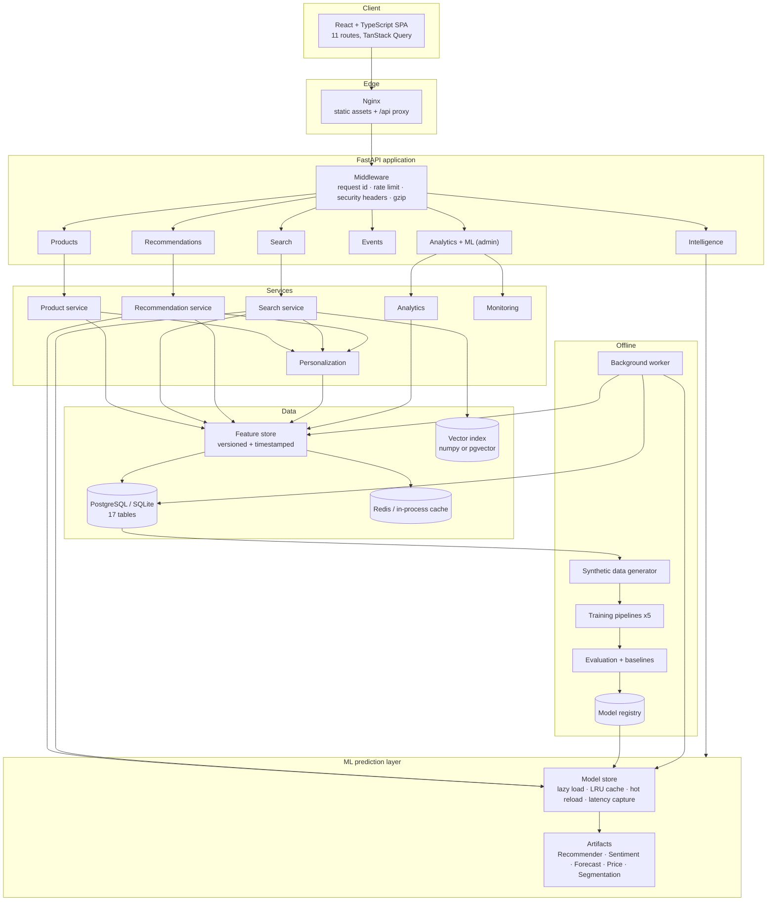
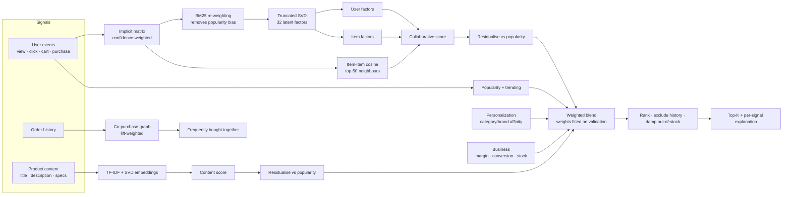
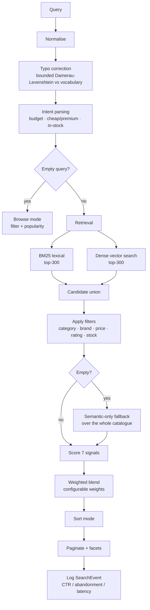
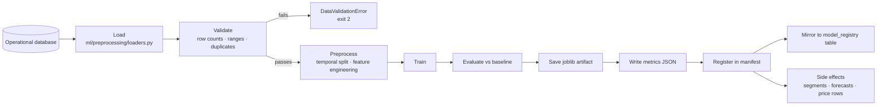
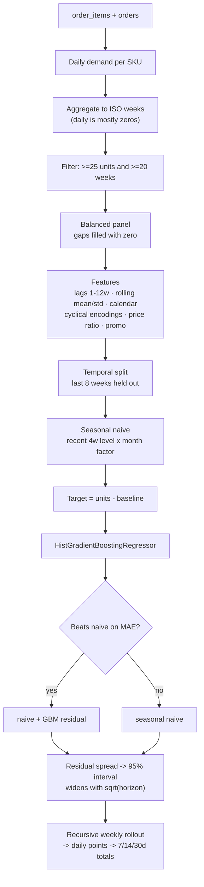
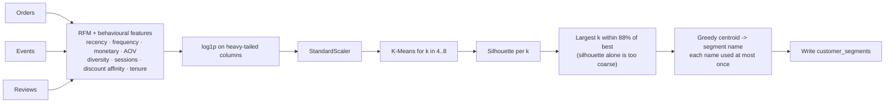
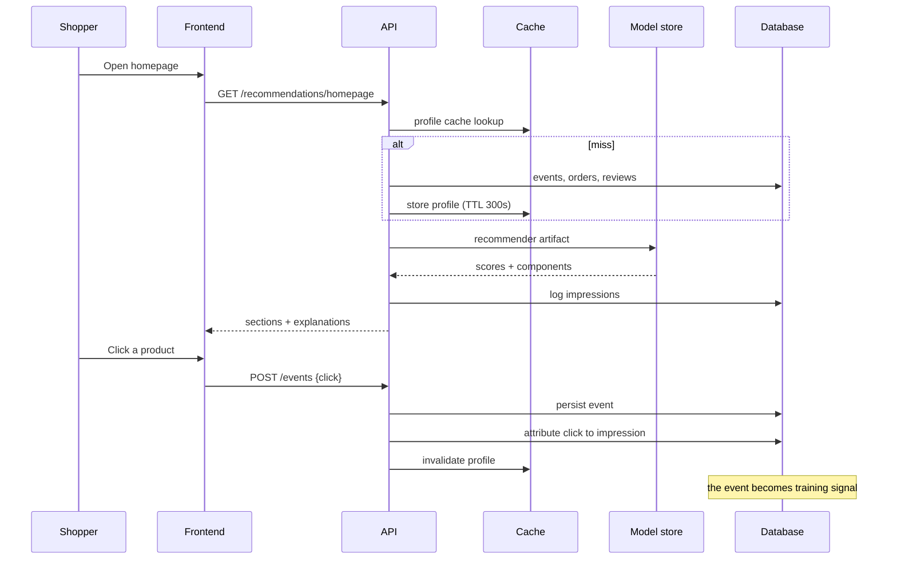
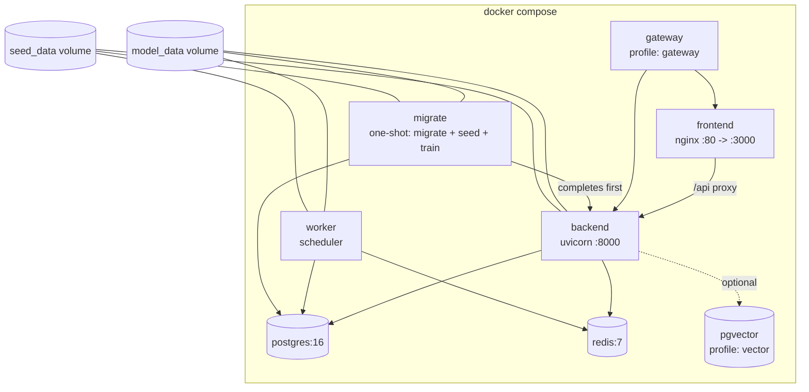

# Architecture

## 1. System architecture

## 2. Recommendation pipeline

**Cold start.** Unknown users, or users with fewer than three interactions, are
routed to a popularity + trending + rating blend, optionally scoped to their
strongest category affinity. New products are reachable through content
similarity because their embedding exists from the moment they are indexed.

## 3. Search pipeline

Ranking signals: text relevance · semantic similarity · popularity · rating ·
conversion probability · user preference · availability. Each result returns its
signal vector and a human-readable explanation.

## 4. ML training pipeline

Every pipeline subclasses `TrainingPipeline` and implements only
`preprocess / train / evaluate`; the template method owns validation, timing,
persistence and registration.

## 5. Demand forecasting pipeline

## 6. Customer segmentation

## 7. Data flow

## 8. Deployment architecture

Health checks are defined on every container; `backend` waits for `postgres`,
`redis` and successful completion of `migrate` before accepting traffic.

## Design decisions

**Why residualise recommendation components?** Measured: the naive weighted blend
scored NDCG@10 0.036 against a popularity baseline of 0.085 — 58% *worse*. Raw
collaborative and content scores are dominated by the popularity direction, so
adding them to a blend that already scores popularity just adds noise. Projecting
that direction out makes each component contribute orthogonal information, and
the same blend then beats the baseline.

**Why fit blend weights instead of hard-coding them?** The specified starting
weights (0.35/0.25/0.15/0.15/0.10) were tuned for a different data distribution.
Fitting on a validation slice of the post-cutoff window — never the test slice —
moved held-out NDCG@10 from 0.037 to 0.062. The fitted weights are stored in the
artifact and remain overridable per request.

**Why an in-process vector index by default?** For a catalogue of this size an
exact cosine scan is a single dense matmul: sub-millisecond, no approximation
error, no extra stateful service. pgvector is wired and ready behind
`VECTOR_DB_URL` for catalogues where that stops being true.

**Why weekly forecasting?** The median SKU sells fewer than one unit per day, so
a daily target is mostly zeros and the model degenerates to predicting zero.
Weekly aggregation is standard retail practice and preserves the seasonality that
actually drives replenishment.
